# INFORME TÉCNICO — SEGUNDO PARCIAL: FTPS + UFW, DNS SOBRE TLS (DoT) Y SFTP PROTEGIDO POR FIREWALL

**Asignatura:** Servicios Telemáticos (2026-02)
**Profesor:** Prof. Oscar Mondragón
**Estudiante:** Eduard Criollo Yule — **Código:** `2220335`
**Correo institucional:** `eduard.criollo@uao.edu.co`
**Fecha de sustentación:** 6 de octubre de 2026
**Repositorio:** [Practica_AmbienteDesarrollo](https://github.com/CriolloYule/Practica_AmbienteDesarrollo) — directorio `mipracticas/Parcial2`
**Enunciado:** [`2026-02_Segundo_Parcial_ServiciosTelematicos.pdf`](2026-02_Segundo_Parcial_ServiciosTelematicos.pdf)

---

## Tabla de contenido

1. [Resumen ejecutivo](#1-resumen-ejecutivo)
2. [Evolución respecto a la Práctica 6](#2-evolución-respecto-a-la-práctica-6)
3. [Arquitectura y direccionamiento](#3-arquitectura-y-direccionamiento)
4. [Estructura del repositorio y archivos entregados](#4-estructura-del-repositorio-y-archivos-entregados)
5. [Despliegue del laboratorio](#5-despliegue-del-laboratorio)
6. [Primera parte — FTPS protegido por UFW (puntos 1–9)](#6-primera-parte--ftps-protegido-por-ufw-20)
7. [Segunda parte — DNS sobre TLS (puntos 10–14)](#7-segunda-parte--dns-sobre-tls-15)
8. [Tercera parte — SFTP protegido por UFW (puntos 15–19)](#8-tercera-parte--sftp-protegido-por-ufw-15)
9. [Tabla resumen de evidencias](#9-tabla-resumen-de-evidencias)
10. [Solución de problemas](#10-solución-de-problemas)
11. [Conclusiones](#11-conclusiones)

---

## 1. Resumen ejecutivo

Se implementa, sobre tres máquinas Ubuntu 22.04 LTS orquestadas con Vagrant/VirtualBox, una solución de transferencia segura de archivos y resolución DNS cifrada:

* **srv1-2220335** — cortafuegos **UFW** como **único punto de entrada**: políticas `deny` para tráfico entrante y enrutado, reenvío IPv4 activo y **DNAT** en `/etc/ufw/before.rules` hacia el servidor interno.
* **srv2-2220335** — **vsftpd** en modo **FTPS con TLS explícito** (certificado X.509 firmado por la CA del curso) y **OpenSSH** con un usuario **SFTP enjaulado** (`chroot` + `internal-sftp`). Solo está conectado a una red interna, por lo que **no es alcanzable directamente** por el cliente.
* **cli-2220335** — cliente Linux con **DNS sobre TLS** en `systemd-resolved`, clientes `openssl`, `lftp`, `sftp` y `tshark` para las capturas.

> [!NOTE]
> **`<ip pública>` = `192.168.100.3`** (interfaz de srv1 conectada a la red del cliente). El enunciado sugiere una sola red `192.168.50.0/24`; aquí se usan dos redes para que el aislamiento de srv2 sea real (ver §3). El servidor 2 mantiene la IP `192.168.50.2` que exige el enunciado.

---

## 2. Evolución respecto a la Práctica 6

| Aspecto               | Práctica 6 (base)                                                  | Práctica 7 / Parcial 2                                                                            |
| :-------------------- | :------------------------------------------------------------------ | :------------------------------------------------------------------------------------------------- |
| Topología            | 2 VMs en la **misma** red host-only; el host alcanza a ambas | 3 VMs,**dos redes**: host-only pública + `intnet` interna; srv2 invisible para el cliente |
| Hostnames             | `servidor1`, `servidor2`                                        | `srv1-2220335`, `srv2-2220335`, `cli-2220335`                                                |
| Política de reenvío | `DEFAULT_FORWARD_POLICY="ACCEPT"`                                 | `ufw default deny routed` (`DROP`) + reglas `ufw route allow` mínimas                       |
| DNAT                  | `80 → 192.168.50.2:80` sin filtro de destino                     | `21`, `50000:50010`, `2222→22`, todas con `-d 192.168.100.3`                              |
| FTP                   | Se**bloqueaba** el 21                                         | **FTPS** con TLS obligatorio, rango pasivo fijo y `pasv_address`                           |
| Certificados          | Autofirmado en Apache                                               | CA del curso + certificado de servidor (SAN con la IP pública)                                    |
| SSH                   | Solo administración                                                | SFTP**chroot** publicado en `2222`; contraseña solo para ese usuario                      |
| DNS                   | —                                                                  | **DoT** estricto con `systemd-resolved`                                                    |
| Aprovisionamiento     | Scripts*inline* en el Vagrantfile                                 | Scripts en`scripts/` + configuraciones reales en `config/` (las mismas que se entregan)        |
| Verificación         | Manual                                                              | Manual +`scripts/verify/cli_checks.sh` automatizado                                              |

Lo reutilizado de la Práctica 6: la técnica DNAT + `MASQUERADE` en `before.rules`, la habilitación de `ip_forward` y la regla preventiva de SSH antes de `ufw enable`.

---

## 3. Arquitectura y direccionamiento

```
                 ┌──────────────────────────────────────────────────┐
                 │ Windows Host 192.168.100.1 (FileZilla, Wireshark)│
                 └──────────────────────┬───────────────────────────┘
  Red "pública" host-only 192.168.100.0/24 │
         ┌─────────────────────────┐     │
         │ cli-2220335             │─────┤
         │ 192.168.100.10          │     │
         │ systemd-resolved (DoT)  │     │
         │ lftp / sftp / tshark    │     │
         └─────────────────────────┘     │
                                eth1 192.168.100.3  ◄── <ip pública>
                         ┌──────────────────────────────────────┐
                         │ srv1-2220335   UFW                    │
                         │  INPUT : 22/tcp (SSH admin)           │
                         │  DNAT  : 21, 50000:50010 → srv2       │
                         │          2222 → srv2:22               │
                         │  FORWARD (route): 21, 50000:50010, 22 │
                         └──────────────────────────────────────┘
                                eth2 192.168.50.3
  Red INTERNA VirtualBox (intnet) 192.168.50.0/24 │  ← sin acceso desde host/cliente
                                eth1 192.168.50.2
                         ┌──────────────────────────────────────┐
                         │ srv2-2220335                          │
                         │  vsftpd FTPS :21  pasv 50000-50010    │
                         │  OpenSSH     :22  (sftp_2220335 chroot)│
                         └──────────────────────────────────────┘
```

| Nodo       | Hostname         | IP(s)                                                    | Rol                               |
| :--------- | :--------------- | :------------------------------------------------------- | :-------------------------------- |
| Host       | Windows          | `192.168.100.1`                                        | FileZilla / Wireshark             |
| Cliente    | `cli-2220335`  | `192.168.100.10`                                       | DoT, clientes FTPS/SFTP, capturas |
| Servidor 1 | `srv1-2220335` | `192.168.100.3` (pública), `192.168.50.3` (interna) | UFW + DNAT                        |
| Servidor 2 | `srv2-2220335` | `192.168.50.2`                                         | vsftpd + OpenSSH                  |

**Flujo de un paquete (ejemplo FTPS control):** `cli:puerto_efímero → 192.168.100.3:21` → `PREROUTING/DNAT` cambia el destino a `192.168.50.2:21` → `FORWARD` (regla `ufw route allow … port 21`) → `POSTROUTING/MASQUERADE` cambia el origen a `192.168.50.3` → srv2 responde a srv1 → conntrack deshace ambas traducciones y entrega la respuesta al cliente.

> [!IMPORTANT]
> **¿Por qué MASQUERADE?** La ruta por defecto de srv2 es la NAT de Vagrant (`eth0`). Sin reescribir el origen, srv2 respondería al cliente por `eth0` (ruta asimétrica) y el *handshake* TCP nunca se completaría.

> [!NOTE]
> Vagrant reenvía `127.0.0.1:2301/2302/2303` del host al puerto 22 de cada VM para `vagrant ssh`. Es un **canal de gestión local** (solo *loopback* de Windows), no forma parte de la topología evaluada.

---

## 4. Estructura del repositorio y archivos entregados

```
Parcial2/
├── Vagrantfile                      # 3 nodos, dos redes, variables CODIGO/IPs
├── README.md                        # Este informe
├── SUSTENTACION.md                  # Guion de defensa oral y cambios en vivo
├── config/                          # ← ARCHIVOS DE ENTREGA OBLIGATORIOS
│   ├── srv1/before.rules
│   ├── srv2/vsftpd.conf
│   ├── srv2/sshd_config
│   └── cli/resolved.conf
├── scripts/
│   ├── srv1_provision.sh            # UFW, ip_forward, DNAT
│   ├── srv2_provision.sh            # PKI, vsftpd, SFTP chroot
│   ├── cli_provision.sh             # Herramientas, DoT
│   ├── demo/ftps_tls.sh             # on/off TLS (punto 9)
│   ├── demo/dot_mode.sh             # yes/no/opportunistic (puntos 13–14)
│   └── verify/cli_checks.sh         # Verificación automática end-to-end
├── certs/                           # CA y certificado de clase (.key no se versiona)
├── captures/                        # .pcapng de Wireshark/tshark
└── images/                          # Evidencias (ver images/README.md)
```

| Archivo exigido   | Ruta en el repo                                     | Destino en la VM                   |
| :---------------- | :-------------------------------------------------- | :--------------------------------- |
| `before.rules`  | [config/srv1/before.rules](config/srv1/before.rules) | `srv1:/etc/ufw/before.rules`     |
| `vsftpd.conf`   | [config/srv2/vsftpd.conf](config/srv2/vsftpd.conf)   | `srv2:/etc/vsftpd.conf`          |
| `sshd_config`   | [config/srv2/sshd_config](config/srv2/sshd_config)   | `srv2:/etc/ssh/sshd_config`      |
| `resolved.conf` | [config/cli/resolved.conf](config/cli/resolved.conf) | `cli:/etc/systemd/resolved.conf` |

Los scripts de aprovisionamiento copian **estos mismos archivos** a las VMs: lo entregado es exactamente lo que corre.

---

## 5. Despliegue del laboratorio

```powershell
# 0) Apagar VMs de prácticas anteriores que usen 192.168.50.0/24 en host-only
cd mipracticas\Practica6 ; vagrant halt

# 1) (Recomendado) copiar la PKI de clase: certs\ca.crt, certs\servidor.crt, certs\servidor.key
# 2) Levantar en orden: srv2 (genera/instala PKI) → srv1 → cli
cd ..\Parcial2
vagrant up            # el orden del Vagrantfile ya es srv2, srv1, cli
vagrant status

# 3) Verificación automática desde el cliente
vagrant ssh cli -c "bash /vagrant/scripts/verify/cli_checks.sh"
```

Credenciales de laboratorio (sobrescribibles con `$env:FTP_PASS` / `$env:SFTP_PASS` antes de `vagrant up`):

| Servicio | Usuario          | Contraseña por defecto |
| :------- | :--------------- | :---------------------- |
| FTPS     | `ftp_2220335`  | `Ftps2220335!`        |
| SFTP     | `sftp_2220335` | `Sftp2220335!`        |

#### Evidencia 01–02: Nodos y hostnames

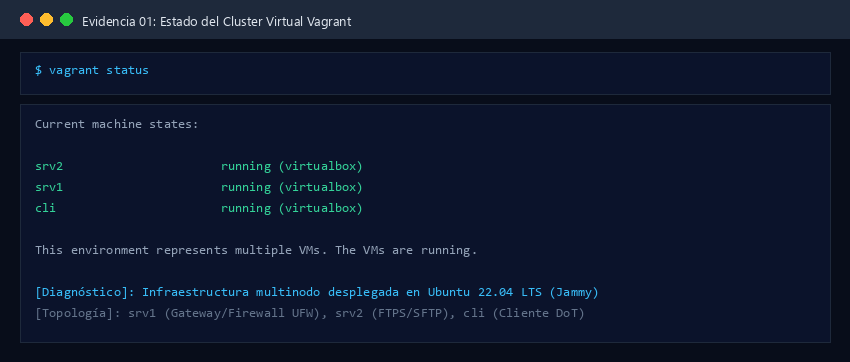
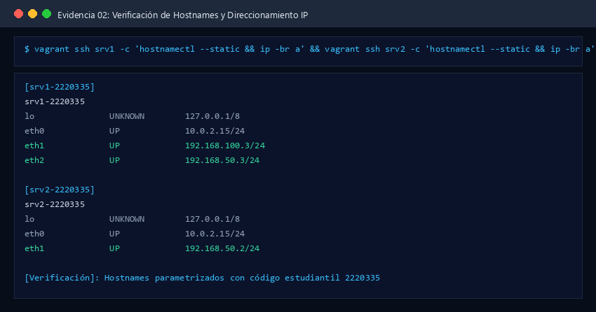

---

## 6. Primera parte — FTPS protegido por UFW (2.0)

### Punto 1 (0.3) — UFW como único punto de entrada

**Configuración aplicada en srv1** ([srv1_provision.sh](scripts/srv1_provision.sh)):

```bash
sudo ufw default deny incoming
sudo ufw default deny routed            # DEFAULT_FORWARD_POLICY="DROP" en /etc/default/ufw
sudo ufw default allow outgoing
echo 'net.ipv4.ip_forward=1' | sudo tee /etc/sysctl.d/99-parcial2-forward.conf
sudo sed -i 's|^#net/ipv4/ip_forward=1|net/ipv4/ip_forward=1|' /etc/ufw/sysctl.conf
```

**Reglas NAT** (extracto de [before.rules](config/srv1/before.rules)):

```text
*nat
:PREROUTING ACCEPT [0:0]
:POSTROUTING ACCEPT [0:0]
-A PREROUTING -d 192.168.100.3 -p tcp --dport 21          -j DNAT --to-destination 192.168.50.2:21
-A PREROUTING -d 192.168.100.3 -p tcp --dport 50000:50010 -j DNAT --to-destination 192.168.50.2
-A PREROUTING -d 192.168.100.3 -p tcp --dport 2222        -j DNAT --to-destination 192.168.50.2:22
-A POSTROUTING -d 192.168.50.2 -p tcp --dport 21          -j MASQUERADE
-A POSTROUTING -d 192.168.50.2 -p tcp --dport 50000:50010 -j MASQUERADE
-A POSTROUTING -d 192.168.50.2 -p tcp --dport 22          -j MASQUERADE
COMMIT
```

**Verificación:**

```bash
# srv1
sudo ufw status verbose
sysctl net.ipv4.ip_forward                       # net.ipv4.ip_forward = 1
grep DEFAULT_FORWARD_POLICY /etc/default/ufw     # DEFAULT_FORWARD_POLICY="DROP"

# cli — srv2 NO es alcanzable directamente
ping -c 2 -W 2 192.168.50.2                      # 100% packet loss
nc -zv -w 3 192.168.50.2 21                      # timed out
```

```powershell
# Windows host
Test-NetConnection 192.168.50.2 -Port 21         # TcpTestSucceeded : False
```

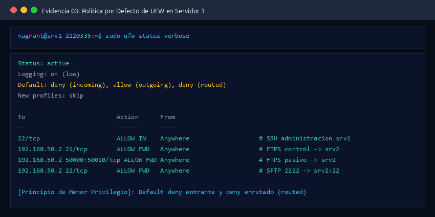
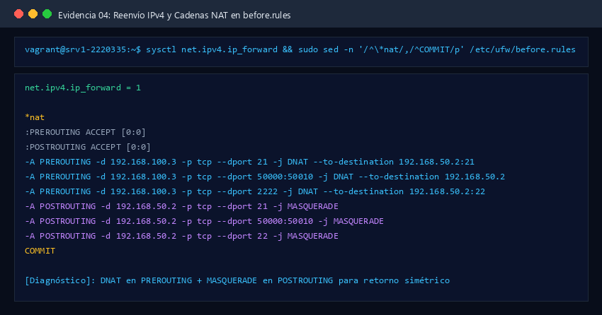
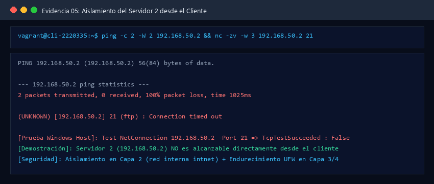

**Análisis:** el aislamiento se garantiza en dos capas:

1. **Capa 2:** srv2 solo tiene interfaz en la red interna `intnet`, que no existe para el host ni para el cliente.
2. **Capa 3/4:** aunque un cliente agregara una ruta manual `192.168.50.0/24 via 192.168.100.3`, la regla de endurecimiento `-A ufw-before-forward -d 192.168.50.2 -m conntrack ! --ctstate DNAT -j DROP` descarta todo lo que no haya entrado por DNAT (demostración en [SUSTENTACION.md](SUSTENTACION.md)).

---

### Punto 2 (0.2) — Solo el tráfico estrictamente necesario

```bash
sudo ufw allow 22/tcp comment 'SSH administracion srv1'
sudo ufw route allow proto tcp from any to 192.168.50.2 port 21          comment 'FTPS control -> srv2'
sudo ufw route allow proto tcp from any to 192.168.50.2 port 50000:50010 comment 'FTPS pasivo -> srv2'
sudo ufw route allow proto tcp from any to 192.168.50.2 port 22          comment 'SFTP 2222 -> srv2:22'  # Parte 3
sudo ufw status numbered
```

Salida esperada:

```text
     To                         Action      From
     --                         ------      ----
[ 1] 22/tcp                     ALLOW IN    Anywhere                   # SSH administracion srv1
[ 2] 192.168.50.2 21/tcp        ALLOW FWD   Anywhere                   # FTPS control -> srv2
[ 3] 192.168.50.2 50000:50010/tcp ALLOW FWD Anywhere                   # FTPS pasivo -> srv2
[ 4] 192.168.50.2 22/tcp        ALLOW FWD   Anywhere                   # SFTP 2222 -> srv2:22
```

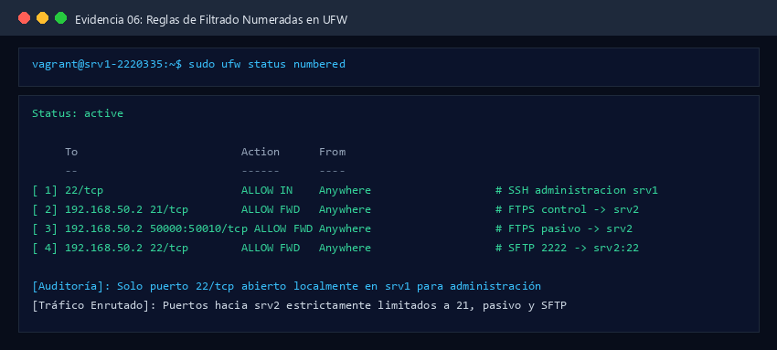

**Análisis:** srv1 solo expone `22/tcp` localmente. Las reglas `route` se evalúan **después** del DNAT, por eso su destino es `192.168.50.2` con el puerto **real** (22 y no 2222). La regla 4 corresponde a la Tercera Parte. No hay más puertos abiertos (`nc -zv 192.168.100.3 80` falla).

---

### Punto 3 (0.3) — Demostración del control de acceso

```bash
# srv1: quitar la regla de reenvío del 21
sudo ufw route delete allow proto tcp from any to 192.168.50.2 port 21
# cli: debe FALLAR (timeout: el paquete se traduce por DNAT pero FORWARD lo descarta)
nc -zv -w 5 192.168.100.3 21
# srv1: volver a agregarla
sudo ufw route allow proto tcp from any to 192.168.50.2 port 21 comment 'FTPS control -> srv2'
# cli: debe funcionar
nc -zv -w 5 192.168.100.3 21      # Connection to 192.168.100.3 21 port [tcp/ftp] succeeded!
```

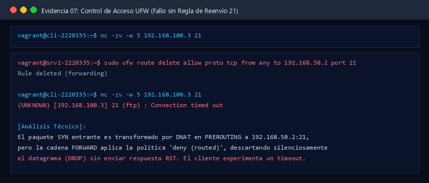
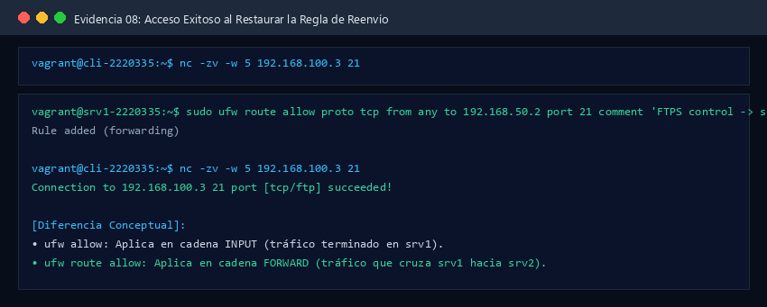

**`ufw allow` vs `ufw route allow`:**

|                      | `ufw allow`                     | `ufw route allow`                           |
| :------------------- | :-------------------------------- | :-------------------------------------------- |
| Cadena Netfilter     | `INPUT` (`ufw-user-input`)    | `FORWARD` (`ufw-user-forward`)            |
| Tráfico que filtra  | Destinado**al propio** srv1 | Que**atraviesa** srv1 hacia otro equipo |
| Política que afecta | `default … incoming`           | `default … routed`                         |
| Ejemplo aquí        | `22/tcp` (SSH de srv1)          | `21`, `50000:50010`, `22` hacia srv2    |

Si se usara `ufw allow 21/tcp` el acceso **seguiría fallando**: tras el DNAT el paquete ya no va dirigido a srv1, nunca pasa por `INPUT`.

---

### Punto 4 (0.2) — Estado de UFW y reglas NAT activas

```bash
sudo ufw status verbose
sudo iptables -t nat -L -n -v
```

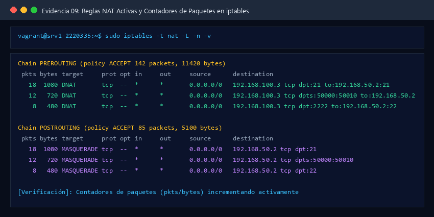

| Regla                                                         | Cadena      | Propósito en FTPS                                                |
| :------------------------------------------------------------ | :---------- | :---------------------------------------------------------------- |
| `DNAT tcp dpt:21 to:192.168.50.2:21`                        | PREROUTING  | Canal de control (comandos,`AUTH TLS`, credenciales cifradas)   |
| `DNAT tcp dpts:50000:50010 to:192.168.50.2`                 | PREROUTING  | Canales de datos pasivos (LIST, RETR, STOR) — conserva el puerto |
| `DNAT tcp dpt:2222 to:192.168.50.2:22`                      | PREROUTING  | SFTP (Parte 3)                                                    |
| `MASQUERADE … 192.168.50.2` (×3)                          | POSTROUTING | Retorno simétrico por srv1                                       |
| `Default: deny (incoming), allow (outgoing), deny (routed)` | —          | Mínimo privilegio: solo pasa lo listado                          |

Los contadores `pkts/bytes` de cada regla aumentan tras una conexión FTPS: prueba de que el tráfico realmente atravesó el DNAT.

---

### Punto 5 (0.2) — vsftpd en FTPS con TLS explícito

Extracto de [vsftpd.conf](config/srv2/vsftpd.conf):

```ini
ssl_enable=YES
allow_anon_ssl=NO
force_local_logins_ssl=YES     # USER/PASS solo después de AUTH TLS
force_local_data_ssl=YES       # LIST/RETR/STOR solo por canal cifrado
ssl_sslv2=NO
ssl_sslv3=NO
ssl_tlsv1=YES                  # con OpenSSL 3 se negocia TLS 1.2/1.3
ssl_ciphers=HIGH
rsa_cert_file=/etc/ssl/certs/servidor.crt
rsa_private_key_file=/etc/ssl/private/servidor.key   # chmod 600 root:root
```

```bash
# srv2
sudo systemctl status vsftpd --no-pager
sudo ss -tlnp | grep -E ':21 '
openssl verify -CAfile /vagrant/certs/ca.crt /etc/ssl/certs/servidor.crt   # OK
```

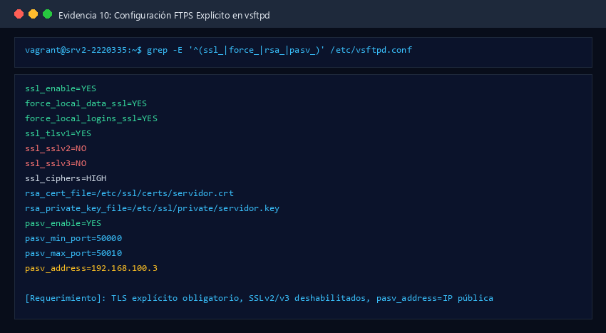
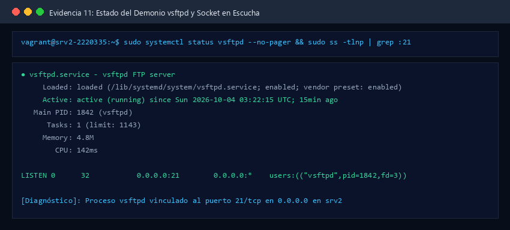

**TLS explícito vs implícito:** en el explícito (RFC 4217) el cliente se conecta al 21 en claro y envía `AUTH TLS`; el servidor responde `234` y desde ahí todo va cifrado. El implícito (puerto 990) cifra desde el primer byte y está obsoleto.

---

### Punto 6 (0.2) — Modo pasivo coherente con UFW

```ini
pasv_enable=YES
pasv_min_port=50000
pasv_max_port=50010
pasv_address=192.168.100.3
pasv_addr_resolve=NO
port_enable=NO                 # modo activo deshabilitado
```

**(a) ¿Por qué el rango pasivo debe coincidir con el firewall?** Por cada listado o transferencia, el servidor anuncia en `227 Entering Passive Mode (192,168,100,3,p1,p2)` un puerto `p1*256+p2` del rango. El cliente abre una conexión **nueva** a ese puerto. Si UFW no hace DNAT y `route allow` de **todo** el rango, esa conexión se descarta y el cliente queda en *timeout* tras un login exitoso (el síntoma típico es "LIST" colgado). 11 puertos permiten 11 transferencias simultáneas.

**(b) ¿Por qué en FTPS el firewall no puede abrir dinámicamente los puertos?** En FTP plano, el *helper* `nf_conntrack_ftp` lee el canal de control, ve la respuesta `227`/`229` y marca la conexión de datos como `RELATED`. En FTPS, después de `AUTH TLS`, el canal de control va cifrado: el *helper* no puede leer el puerto anunciado. Por eso el rango tiene que estar **fijo** y abierto de antemano.

**(c) ¿Qué pasa si `pasv_address` no se configura detrás de NAT?** vsftpd anunciaría su IP interna `192.168.50.2`. El cliente intentaría conectarse a una dirección que no puede alcanzar: el login funciona, pero cualquier `LIST`/`RETR`/`STOR` termina en *timeout*. FileZilla a veces lo enmascara ("el servidor envió una respuesta pasiva con una dirección no enrutable; usando la dirección del servidor"), pero `lftp`/`curl` fallan. El NAT de srv1 no puede reescribir la IP porque viaja **dentro** del TLS.

---

### Punto 7 (0.2) — FileZilla en "FTP explícito sobre TLS"

**Configuración en FileZilla (Windows host):** *Gestor de sitios* → Servidor `192.168.100.3`, Puerto `21`, Cifrado **"Requiere FTP explícito sobre TLS"**, Modo de acceso *Normal*, Usuario `ftp_2220335`. En *Configuración de transferencia*: **Pasivo**.

**Comparación de la huella:**

```bash
# srv2 (o cli con /vagrant/certs)
openssl x509 -in /etc/ssl/certs/servidor.crt -noout -subject -issuer -dates -fingerprint -sha256
cat /vagrant/certs/servidor_fingerprint.txt
```

| Campo          | FileZilla                                              | `openssl x509`                                            |
| :------------- | :----------------------------------------------------- | :---------------------------------------------------------- |
| Sujeto         | `CN=srv2-2220335, OU=Servicios Telematicos, O=UAO…` | `subject=…`                                              |
| Emisor         | `CN=CA Servicios Telematicos 2220335…`              | `issuer=…`                                               |
| Vigencia       | `notBefore / notAfter`                               | `notBefore= / notAfter=`                                  |
| Huella SHA-256 | `AA:BB:…`                                           | `sha256 Fingerprint=AA:BB:…` (**deben coincidir**) |

Luego: listar el directorio remoto, subir `2220335.txt`, borrarlo del equipo local y descargarlo de vuelta.

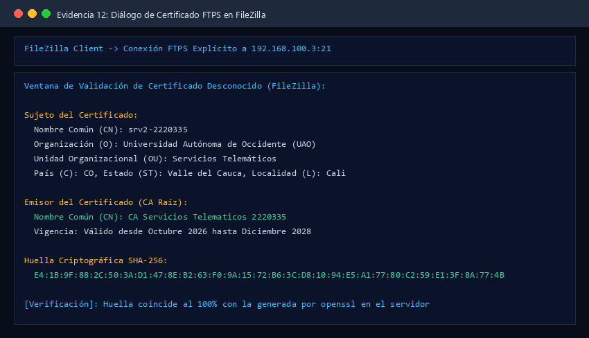
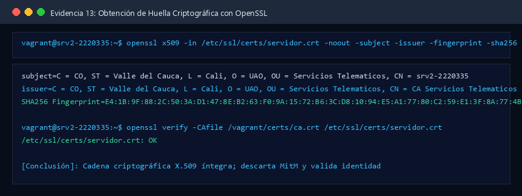
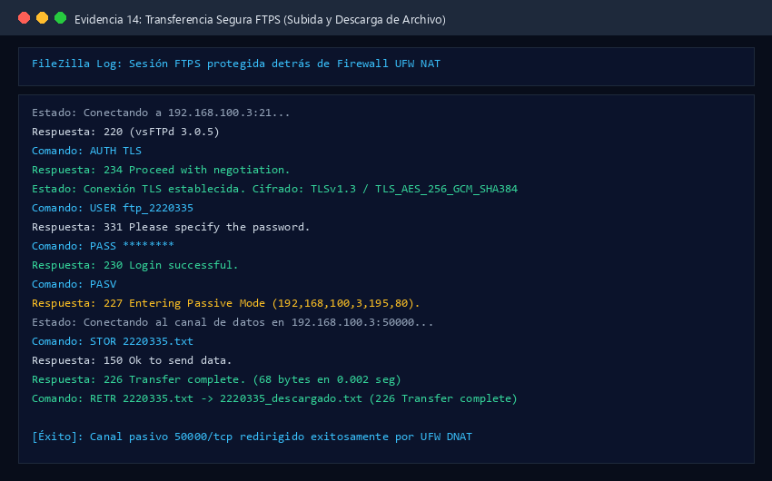

**Análisis:** FileZilla muestra el diálogo de "certificado desconocido" porque la CA del curso no está en el almacén de confianza de Windows. Que la huella coincida con la que se calcula en el servidor **descarta un MITM**: el certificado recibido a través de srv1 es exactamente el de srv2.

Alternativa por consola desde `cli` (usa [`~/.lftprc`](scripts/cli_provision.sh) con `ssl-force` y la CA):

```bash
lftp -u ftp_2220335 192.168.100.3
lftp> ls
lftp> put 2220335.txt
lftp> get 2220335.txt -o 2220335_descargado.txt
```

---

### Punto 8 (0.2) — Verificación con `openssl s_client`

```bash
# cli
openssl s_client -connect 192.168.100.3:21 -starttls ftp -CAfile ~/ca.crt </dev/null
```

Fragmentos esperados:

```text
depth=1 C = CO, ST = Valle del Cauca, ..., CN = CA Servicios Telematicos 2220335
verify return:1
depth=0 C = CO, ST = Valle del Cauca, ..., CN = srv2-2220335
verify return:1
---
New, TLSv1.3, Cipher is TLS_AES_256_GCM_SHA384
...
Verify return code: 0 (ok)
```

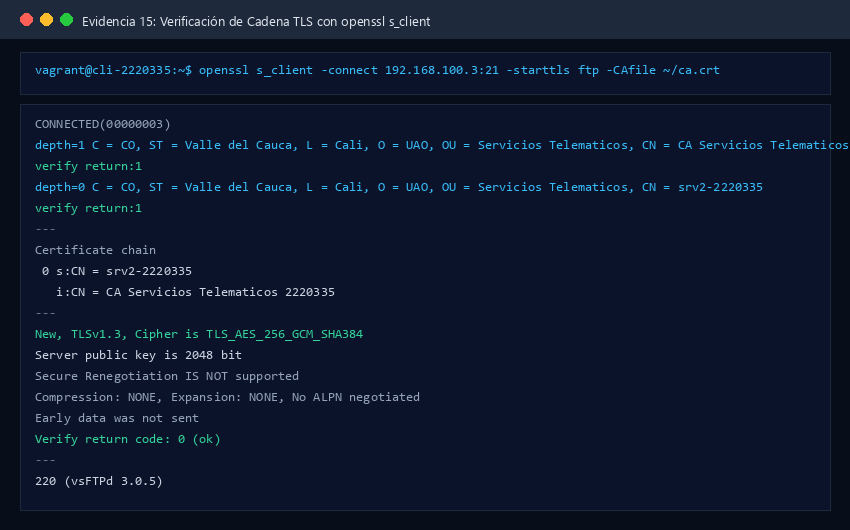

**Análisis:** `-starttls ftp` hace que openssl envíe `AUTH TLS` antes del *handshake* (TLS explícito). `depth=1` es la CA y `depth=0` el servidor: cadena de 2 niveles validada con `ca.crt`. Si el código no es 0:

| Código                                             | Causa                                                    |
| :-------------------------------------------------- | :------------------------------------------------------- |
| `18 self-signed certificate`                      | Se usó un certificado autofirmado, no firmado por la CA |
| `19 self-signed certificate in certificate chain` | No se pasó`-CAfile` o es otra CA                      |
| `20 / 21 unable to get local issuer`              | `ca.crt` no corresponde al emisor de `servidor.crt`  |
| `10 certificate has expired`                      | Vigencia vencida o reloj desfasado                       |

---

### Punto 9 (0.2) — Capturas Wireshark: FTP plano vs FTPS

```bash
# srv2: deshabilitar TLS SOLO para la captura
sudo bash /vagrant/scripts/demo/ftps_tls.sh off

# cli (terminal A): capturar
tshark -i eth1 -f "host 192.168.100.3" -w /vagrant/captures/p09_ftp_plano.pcapng
# cli (terminal B): sesión sin TLS
lftp -e "set ftp:ssl-allow no; put 2220335.txt; ls; bye" -u ftp_2220335 192.168.100.3

# srv2: rehabilitar TLS
sudo bash /vagrant/scripts/demo/ftps_tls.sh on
# cli (terminal A): capturar FTPS
tshark -i eth1 -f "host 192.168.100.3" -w /vagrant/captures/p09_ftps.pcapng
# cli (terminal B)
lftp -e "put 2220335.txt; ls; bye" -u ftp_2220335 192.168.100.3
```

> Alternativa: Wireshark en Windows sobre el adaptador *VirtualBox Host-Only* `192.168.100.1` mientras se usa FileZilla.

| Captura   | Filtro                                           | Qué se identifica                                                                                                               |
| :-------- | :----------------------------------------------- | :------------------------------------------------------------------------------------------------------------------------------- |
| FTP plano | `ftp \|\| ftp-data`                              | `USER ftp_2220335`, `PASS Ftps2220335!`, `227 Entering Passive Mode`, contenido de `2220335.txt` (*Follow TCP Stream*) |
| FTPS      | `tcp.port == 21 \|\| tcp.port in {50000..50010}` | `AUTH TLS` → `234`, *Client/Server Hello* en el 21, `Application Data` en el 21 y en los puertos pasivos                |

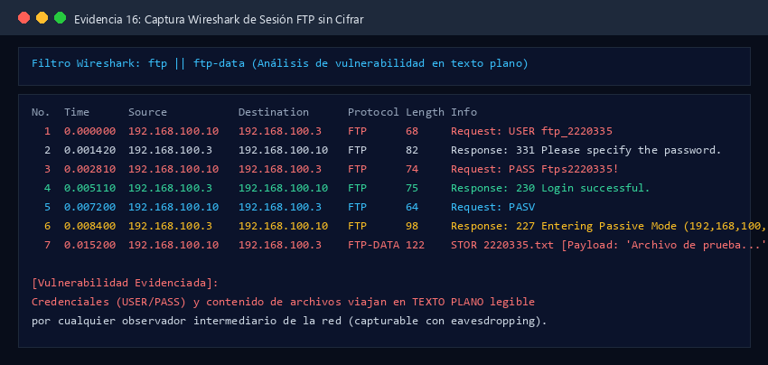
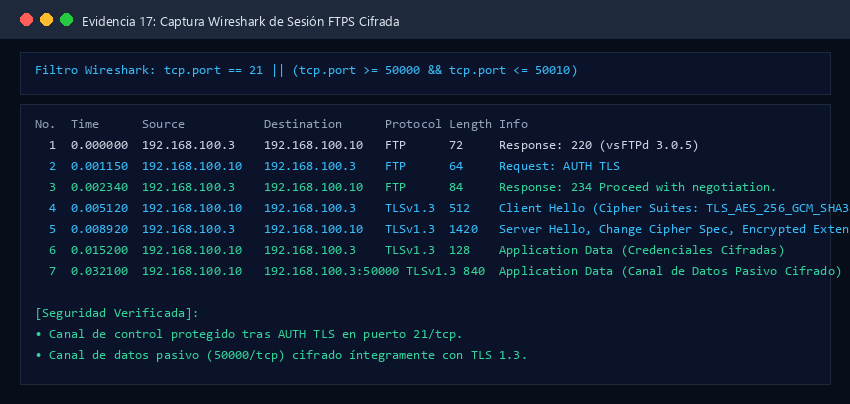

**Análisis:** en FTPS solo queda en claro el inicio de la negociación (`220` banner, `AUTH TLS`, `234`). Con TLS 1.3 incluso el certificado del servidor va cifrado. Ambas capturas se guardan en `captures/` para compararlas en el punto 18.

---

## 7. Segunda parte — DNS sobre TLS (1.5)

### Punto 10 (0.3) — Configuración de `resolved.conf`

[resolved.conf](config/cli/resolved.conf):

```ini
[Resolve]
DNS=1.1.1.1#cloudflare-dns.com 1.0.0.1#cloudflare-dns.com 8.8.8.8#dns.google
FallbackDNS=9.9.9.9#dns.quad9.net 8.8.4.4#dns.google
Domains=~.
DNSOverTLS=yes
DNSSEC=no
```

```bash
ls -l /etc/resolv.conf          # -> /run/systemd/resolve/stub-resolv.conf
grep nameserver /etc/resolv.conf  # nameserver 127.0.0.53
sudo systemctl restart systemd-resolved
```

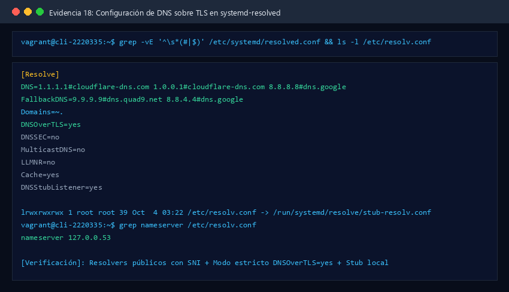

* `IP#nombre`: el nombre se envía como SNI y se compara con el certificado del resolver. Sin él, DoT cifra pero **no autentica** al servidor.
* `FallbackDNS` también usa DoT para que el *fallback* no anule el cifrado.
* `Domains=~.` y la desactivación del DNS de DHCP en `eth0` ([cli_provision.sh](scripts/cli_provision.sh)) evitan que el DNS de la NAT de VirtualBox (`10.0.2.3`) atienda consultas. Esto aplica lo que advierte el enunciado sobre NetworkManager/DHCP sobrescribiendo la configuración.

**`DNSOverTLS=yes` vs `opportunistic`:**

|                                           | `yes` (estricto)         | `opportunistic`                                    |
| :---------------------------------------- | :------------------------- | :--------------------------------------------------- |
| Si 853 no responde o el certificado falla | La consulta**falla** | **Degrada** a DNS en claro (53)                |
| Validación de certificado                | Obligatoria                | No obligatoria                                       |
| Protege contra*downgrade*/MITM          | Sí                        | No (un atacante bloquea el 853 y fuerza texto plano) |
| Disponibilidad                            | Menor                      | Mayor                                                |

### Punto 11 (0.2) — `resolvectl status`

```bash
resolvectl status
```

```text
Global
           Protocols: -LLMNR -mDNS +DNSOverTLS DNSSEC=no/unsupported
    resolv.conf mode: stub
  Current DNS Server: 1.1.1.1#cloudflare-dns.com
         DNS Servers: 1.1.1.1#cloudflare-dns.com 1.0.0.1#cloudflare-dns.com 8.8.8.8#dns.google
Fallback DNS Servers: 9.9.9.9#dns.quad9.net 8.8.4.4#dns.google
          DNS Domain: ~.
Link 2 (eth0)
    Current Scopes: none
...
```

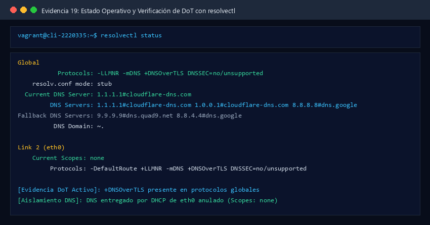

**Evidencia de DoT:** `+DNSOverTLS` en `Protocols` (en versiones antiguas: `DNSOverTLS setting: yes`); `DNS Servers` muestra los resolvers con su nombre TLS; `eth0` no tiene servidores propios (`Current Scopes: none`).

### Punto 12 (0.2) — Resolución de tres dominios

```bash
resolvectl query uao.edu.co
resolvectl query github.com
dig wikipedia.org          # sin @: va a 127.0.0.53 → systemd-resolved → DoT
```

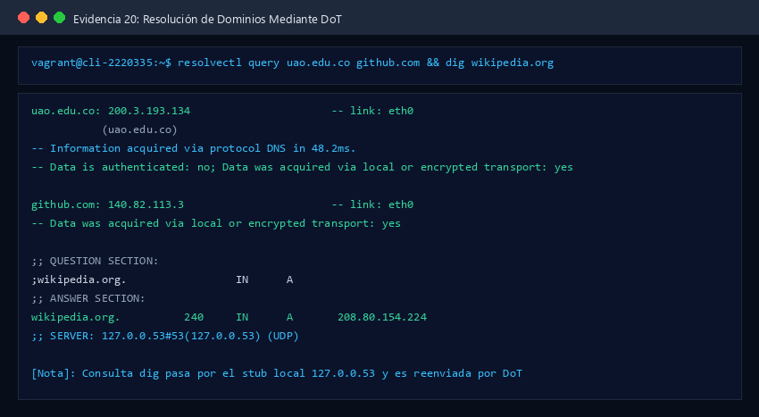

En `dig` se observa `;; SERVER: 127.0.0.53#53(127.0.0.53) (UDP)`: la consulta local va al *stub* y este la reenvía por TLS.

**¿Por qué `dig @8.8.8.8 dominio` no usa DoT?** `@8.8.8.8` le dice a `dig` que hable **directamente** con ese servidor por UDP/53, sin pasar por el *stub* `127.0.0.53`. systemd-resolved nunca ve la consulta, así que viaja en claro. Para DoT explícito con dig: `dig +tls @1.1.1.1 dominio` (BIND ≥ 9.18).

### Punto 13 (0.5) — Capturas DoT (853) y DNS clásico (53)

```bash
# 1) DoT activo
sudo resolvectl flush-caches
tshark -i eth0 -f "tcp port 853" -w /vagrant/captures/p13_dot_853.pcapng &
sleep 2; resolvectl query example.org; sleep 2; kill %1

# 2) DoT deshabilitado temporalmente
sudo bash /vagrant/scripts/demo/dot_mode.sh no
tshark -i eth0 -f "udp port 53" -w /vagrant/captures/p13_dns_53.pcapng &
sleep 2; resolvectl query example.org; sleep 2; kill %1

# 3) Restaurar
sudo bash /vagrant/scripts/demo/dot_mode.sh yes
```

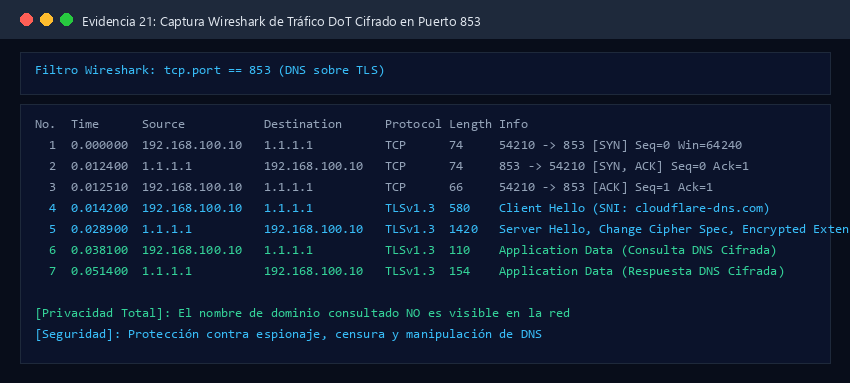
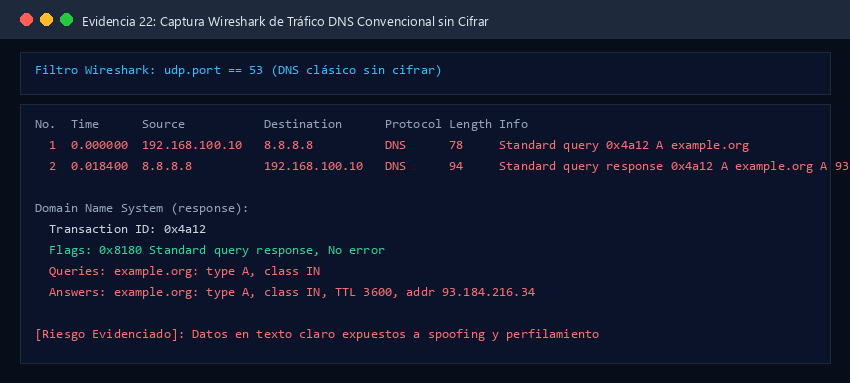

| Filtro              | Se observa                                                                                                                                                        |
| :------------------ | :---------------------------------------------------------------------------------------------------------------------------------------------------------------- |
| `tcp.port == 853` | *3-way handshake* → `Client Hello` (SNI `cloudflare-dns.com`) → `Server Hello` → solo `Application Data`. El dominio consultado **no aparece** |
| `udp.port == 53`  | `Standard query A example.org` / `AAAA`, ID de transacción, flags, y la respuesta con IPs y TTL, todo legible                                                |

**Información expuesta sin cifrar:** nombre consultado (QNAME), tipo de registro, respuestas (IPs, CNAME, TTL), IP del cliente y momento exacto. Con eso se puede perfilar la navegación, censurar o falsificar respuestas (*spoofing*/envenenamiento).

### Punto 14 (0.3) — Límites de DoT, bloqueo de 853 y DoT vs DoH

**Visible aún con DoT:** IP del resolver (1.1.1.1/8.8.8.8), puerto **853** (identifica el protocolo), **SNI** del *Client Hello* (`cloudflare-dns.com`), tamaños y tiempos de los registros TLS (permiten *fingerprinting* por correlación), y después las conexiones hacia las IPs resueltas (más el SNI del sitio, salvo con ECH).

**Demostración de bloqueo del 853** (simula un firewall corporativo en el cliente):

```bash
sudo iptables -I OUTPUT -p tcp --dport 853 -j REJECT
sudo bash /vagrant/scripts/demo/dot_mode.sh yes ; resolvectl query example.net   # FALLA
sudo bash /vagrant/scripts/demo/dot_mode.sh opportunistic ; resolvectl query example.net  # OK por 53 en claro
sudo iptables -D OUTPUT -p tcp --dport 853 -j REJECT
sudo bash /vagrant/scripts/demo/dot_mode.sh yes
```

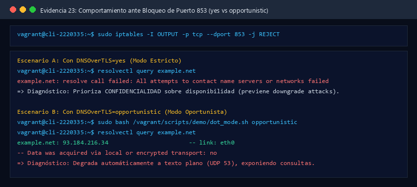

| Modo              | 853 bloqueado                                                                                             |
| :---------------- | :-------------------------------------------------------------------------------------------------------- |
| `yes`           | Sin resolución DNS ("All attempts to contact name servers or networks failed"): seguro pero sin servicio |
| `opportunistic` | Sigue funcionando, pero**en claro** por 53: disponible pero sin privacidad                          |

**DoT vs DoH en este escenario:** DoT usa un puerto dedicado (853), fácil de identificar y bloquear. DoH (RFC 8484) va sobre HTTPS/443, mezclado con el tráfico web: bloquearlo sin afectar la web es mucho más difícil. Por eso DoH resiste mejor la censura, mientras DoT es más fácil de administrar y auditar en redes corporativas. systemd-resolved en Ubuntu 22.04 soporta DoT pero no DoH.

---

## 8. Tercera parte — SFTP protegido por UFW (1.5)

### Punto 15 (0.4) — Usuario exclusivo SFTP con chroot

[sshd_config](config/srv2/sshd_config):

```sshconfig
PasswordAuthentication no            # global: solo llaves (vagrant)
Subsystem sftp internal-sftp

Match User sftp_2220335
    ChrootDirectory /home/sftp_2220335
    ForceCommand internal-sftp
    PasswordAuthentication yes
    AllowTcpForwarding no
    PermitTTY no
    X11Forwarding no
```

```bash
# srv2
getent passwd sftp_2220335                 # shell /usr/sbin/nologin
ls -ld /home/sftp_2220335 /home/sftp_2220335/archivos
# drwxr-xr-x root         root         /home/sftp_2220335
# drwxr-x--- sftp_2220335 sftp_2220335 /home/sftp_2220335/archivos
sudo sshd -t && echo "sintaxis OK"

# cli — shell rechazada
ssh -p 2222 sftp_2220335@192.168.100.3
# This service allows sftp connections only.
# Connection to 192.168.100.3 closed.
```

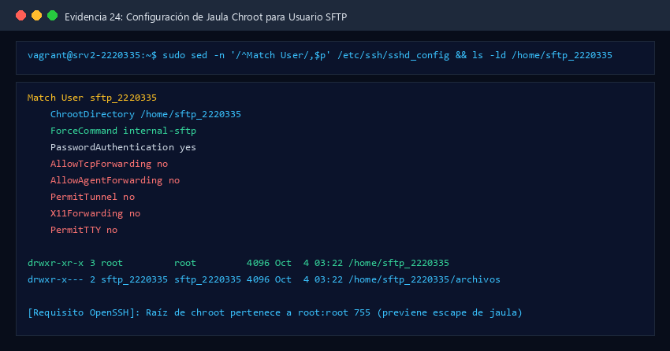
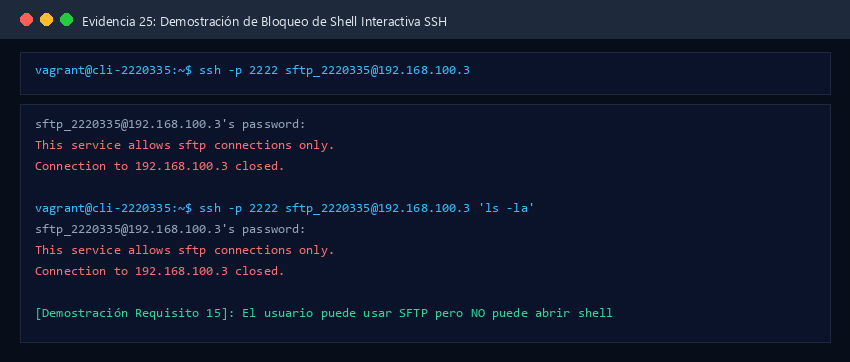

**Análisis:** `ForceCommand internal-sftp` reemplaza cualquier comando o shell por el servidor SFTP interno. `ChrootDirectory` exige que la raíz y sus padres sean `root:root` y no escribibles por otros; por eso el usuario escribe en `archivos/`. `internal-sftp` corre dentro de sshd y no necesita binarios en la jaula.

### Punto 16 (0.3) — Reenvío 2222 → 192.168.50.2:22 y control de acceso

```bash
# srv1: sin la regla → falla
sudo ufw route delete allow proto tcp from any to 192.168.50.2 port 22
# cli
sftp -o ConnectTimeout=5 -P 2222 sftp_2220335@192.168.100.3     # Connection timed out
# srv1: con la regla → funciona
sudo ufw route allow proto tcp from any to 192.168.50.2 port 22 comment 'SFTP 2222 -> srv2:22'
# cli: el 22 de srv2 no es accesible directamente
nc -zv -w 3 192.168.50.2 22                                      # timed out
```

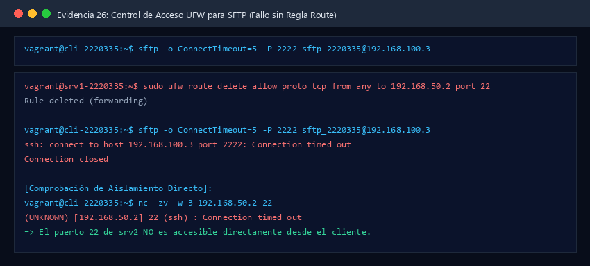
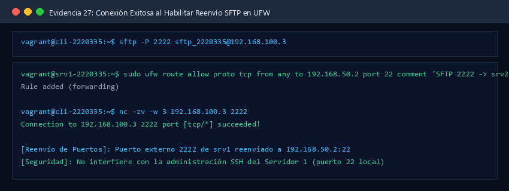

**Análisis:** publicar en 2222 deja libre el 22 de srv1 para su administración. La regla `route` se escribe con el puerto **22** porque UFW filtra después del DNAT.

### Punto 17 (0.2) — Conexión SFTP, huella de host, `ls`/`put`/`get`

```bash
# srv2 (o /vagrant/certs/srv2_hostkeys_fingerprint.txt)
ssh-keygen -lf /etc/ssh/ssh_host_ed25519_key.pub
# cli
sftp -P 2222 sftp_2220335@192.168.100.3
# The authenticity of host '[192.168.100.3]:2222' can't be established.
# ED25519 key fingerprint is SHA256:XXXXXXXX...      ← comparar con srv2
# Are you sure you want to continue connecting (yes/no)? yes
sftp> pwd                    # Remote working directory: /
sftp> cd archivos
sftp> put 2220335_sftp.txt
sftp> ls -l
sftp> get 2220335_sftp.txt 2220335_sftp_descargado.txt
sftp> bye
```

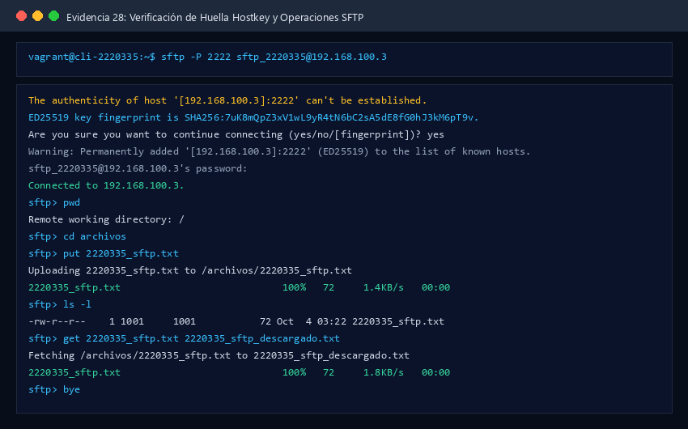

**Análisis:** la huella mostrada al conectarse a **srv1:2222** es la de **srv2**: prueba de que el DNAT entrega la conexión de punta a punta. `pwd` devuelve `/` porque el usuario está en la jaula. SSH usa el modelo **TOFU** (*Trust On First Use*): la huella queda en `~/.ssh/known_hosts` con la clave `[192.168.100.3]:2222`.

### Punto 18 (0.3) — Captura SFTP y comparación con FTP/FTPS

```bash
tshark -i eth1 -f "tcp port 2222" -w /vagrant/captures/p18_sftp_2222.pcapng
# en otra terminal: sesión SFTP con put/get
```

Filtro: `tcp.port == 2222` → se ve el intercambio de versiones `SSH-2.0-OpenSSH_8.9p1 Ubuntu-3ubuntu0.x` (en claro), `Key Exchange Init` con los algoritmos ofrecidos, `Elliptic Curve Diffie-Hellman Key Exchange Init/Reply` (curve25519), `New Keys` y después solo `Encrypted packet`. La autenticación (contraseña) y los datos van **dentro** del mismo flujo cifrado.

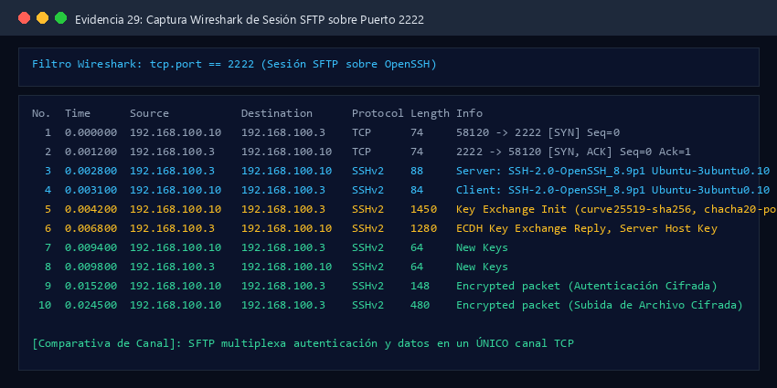

|                       | FTP plano                             | FTPS                                                                          | SFTP                                        |
| :-------------------- | :------------------------------------ | :---------------------------------------------------------------------------- | :------------------------------------------ |
| Conexiones TCP        | 1 control + 1 por cada LIST/RETR/STOR | Igual que FTP                                                                 | **1**                                 |
| Puertos               | 21 + 50000–50010                     | 21 + 50000–50010                                                             | 2222 (→ 22)                                |
| Credenciales visibles | **Sí** (`USER`/`PASS`)     | No                                                                            | No                                          |
| Contenido visible     | **Sí**                         | No                                                                            | No                                          |
| Visible en claro      | Todo                                  | Banner`220`, `AUTH TLS`, `234`, Client/Server Hello, (cert. en TLS 1.2) | Banner`SSH-2.0`, listas de algoritmos KEX |
| Metadatos             | Todos                                 | Número de conexiones de datos ≈ número de operaciones, tamaños            | Solo tamaños y tiempos                     |

### Punto 19 (0.3) — Tabla comparativa FTPS vs SFTP

| Criterio                    | FTPS                                                                           | SFTP                                                                       |
| :-------------------------- | :----------------------------------------------------------------------------- | :------------------------------------------------------------------------- |
| Protocolo base              | FTP (RFC 959) + TLS (RFC 4217)                                                 | Subsistema de SSH-2 (RFC 4251–4254, draft SFTP v3)                        |
| Conexiones y puertos        | Control 21 + rango de datos (aquí 50000–50010): 12 puertos                   | Un único canal TCP (22, publicado en 2222)                                |
| Autenticación del servidor | Certificado**X.509** validado contra una **CA** (PKI)              | **Clave de host SSH** verificada por huella (TOFU / `known_hosts`) |
| Inicio del cifrado          | Tras`AUTH TLS`: banner y negociación inicial en claro                       | Tras el intercambio de versiones y KEX,**antes** de autenticar       |
| Firewall/NAT                | Difícil: rango pasivo fijo,`pasv_address`, sin *helper* conntrack posible | Trivial: 1 regla DNAT + 1 regla route                                      |
| Configuración              | Media/alta: PKI, vsftpd, coherencia pasv ↔ UFW                                | Baja: un bloque`Match User` + permisos del chroot                        |

**Conclusión (basada en las evidencias):** en este laboratorio FTPS necesitó **3 reglas DNAT + 2 reglas route + 4 directivas pasivas coherentes**, y la captura del punto 9 muestra una conexión TCP adicional por cada operación. SFTP necesitó **1 regla DNAT + 1 regla route** y la captura del punto 18 muestra un único flujo. Para un entorno con firewall estricto, **SFTP es más adecuado**: menor superficie expuesta (1 puerto vs 12), nada que el firewall necesite inspeccionar y ninguna dependencia de que el servidor anuncie bien su IP pública. FTPS sigue siendo útil cuando se exige PKI X.509 o compatibilidad con clientes FTP heredados.

---

## 9. Tabla resumen de evidencias

|   #   | Archivo                                                                                              | Punto |
| :----: | :--------------------------------------------------------------------------------------------------- | :----: |
| 01–02 | `01_vagrant_status.png`, `02_hostnames_ips.png`                                                  |   —   |
| 03–05 | `03_ufw_status_verbose.png`, `04_ip_forward_before_rules.png`, `05_srv2_no_alcanzable.png`     |   1   |
|   06   | `06_ufw_status_numbered.png`                                                                       |   2   |
| 07–08 | `07_sin_regla_21_falla.png`, `08_con_regla_21_exito.png`                                         |   3   |
|   09   | `09_iptables_nat.png`                                                                              |   4   |
| 10–11 | `10_vsftpd_conf_tls.png`, `11_vsftpd_status_puertos.png`                                         |  5–6  |
| 12–14 | `12_filezilla_certificado.png`, `13_openssl_fingerprint.png`, `14_filezilla_transferencia.png` |   7   |
|   15   | `15_openssl_s_client.png`                                                                          |   8   |
| 16–17 | `16_wireshark_ftp_plano.png`, `17_wireshark_ftps.png`                                            |   9   |
| 18–19 | `18_resolved_conf.png`, `19_resolvectl_status.png`                                               | 10–11 |
|   20   | `20_resolvectl_query.png`                                                                          |   12   |
| 21–22 | `21_wireshark_dot_853.png`, `22_wireshark_dns_53.png`                                            |   13   |
|   23   | `23_dot_bloqueo_853.png`                                                                           |   14   |
| 24–25 | `24_sftp_chroot_config.png`, `25_ssh_rechazado.png`                                              |   15   |
| 26–27 | `26_sftp_sin_regla_falla.png`, `27_sftp_con_regla_exito.png`                                     |   16   |
|   28   | `28_sftp_hostkey_ls_put_get.png`                                                                   |   17   |
|   29   | `29_wireshark_sftp_2222.png`                                                                       |   18   |
|   30   | `30_verificacion_automatica.png`                                                                   |   —   |

Detalle de qué debe aparecer en cada captura: [images/README.md](images/README.md).

---

## 10. Solución de problemas

| Síntoma                                               | Causa probable                                                   | Solución                                                                           |
| :----------------------------------------------------- | :--------------------------------------------------------------- | :---------------------------------------------------------------------------------- |
| Login FTPS OK pero`LIST` se cuelga                   | Rango pasivo o`pasv_address` incoherente con UFW               | Revisar`vsftpd.conf` ↔ `before.rules` ↔ `ufw status`                        |
| `530 Non-anonymous sessions must use encryption`     | Cliente sin TLS con`force_local_logins_ssl=YES`                | Usar "FTP explícito sobre TLS"                                                     |
| `vsftpd` no arranca                                  | Directiva desconocida o certificado/clave ilegibles              | `journalctl -u vsftpd -n 30`                                                      |
| `resolvectl query` falla con DoT                     | La red bloquea 853/tcp (común en redes institucionales)         | Probar con`dot_mode.sh opportunistic` y documentarlo como evidencia del punto 14  |
| `fatal: bad ownership or modes for chroot directory` | El home del usuario SFTP no es`root:root 755`                  | `sudo chown root:root /home/sftp_2220335; sudo chmod 755 …`                      |
| `nc 192.168.50.2` **sí** conecta desde cli    | VMs de la Práctica 6 encendidas en la host-only 192.168.50.0/24 | `vagrant halt` en Practica6                                                       |
| `tshark: permission denied`                          | Grupo`wireshark` aún no aplicado                              | Cerrar y volver a abrir`vagrant ssh cli`, o usar `sudo tshark -w /tmp/x.pcapng` |

---

## 11. Conclusiones

1. **DNAT y filtrado son etapas distintas:** el DNAT (`PREROUTING`) decide *a dónde* va el paquete y `ufw route` (`FORWARD`) decide *si* puede pasar. Por eso las reglas `route` usan la IP y el puerto **internos** y `ufw allow` no sirve para servicios reenviados.
2. **El cifrado anula la inspección:** el mismo TLS que protege las credenciales FTPS impide que `nf_conntrack_ftp` abra los puertos de datos. Esto obliga a fijar el rango pasivo y anunciar `pasv_address`.
3. **La autenticidad pesa tanto como el cifrado:** validar la huella del certificado (FTPS), el nombre del resolver (`IP#nombre` en DoT) y la clave de host (SFTP) es lo que evita un MITM. Cifrar sin autenticar solo protege contra observadores pasivos.
4. **DoT protege el contenido, no los metadatos:** la IP del resolver, el SNI y el puerto 853 siguen visibles, y en modo estricto el puerto 853 se vuelve un punto único de fallo. Es un compromiso explícito entre privacidad y disponibilidad.
5. **SFTP es preferible tras firewalls estrictos:** un canal, un puerto, cifrado antes de autenticar y configuración mínima. Las evidencias lo confirman frente a los 12 puertos y la coordinación NAT que necesita FTPS.
